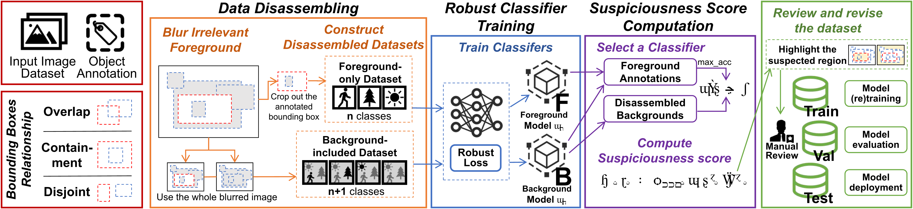

# Datactive

**This repository is an implementation of the paper: Datactive: Dataset Debugging for Object Detection Systems.**

Object detection models are seamlessly integrated into numerous intelligent software systems, playing a crucial role in various tasks. 
These models are typically constructed upon human-annotated datasets, whose quality may significantly influence the model's performance and reliability. 
Erroneous and inadequate annotated datasets can induce classification/localization inaccuracies during deployment, precipitating security breaches or traffic accidents that inflict property damage or even loss of life.
Therefore, ensuring and improving data quality is a crucial issue for the reliability of the object detection system.

In this paper, we propose *Datactive*, a data fault localization technique for object detection systems.
 *Datactive* is designed to locate various types of data faults including mis-localization and missing objects, without utilizing the prediction of object detection models trained on dirty datasets.
To achieve this, we first construct foreground-only and background-included datasets via data disassembling strategies, and then employ a robust learning method to train classifiers using these disassembled datasets. Based on the predictions made by these classifiers,  *Datactive* produces a unified suspiciousness score for both foreground annotations and image backgrounds.
It allows testers to easily identify and correct faulty or missing annotations with minimal effort.
To validate the effectiveness of our technique, we conducted experiments on three application datasets using six baselines, and demonstrated the superiority of  *Datactive* from various aspects.

We also explored *Datactive*'s ability to find natural data faults and its application in both training and evaluation scenarios.
 

## Installation
`pip install -r requirements.txt`

## Usage
You should first transform the annotation of the object detection dataset into the following format `.json` file:
```python
[
    # an instance
    {
        "image_name": "000000312552.jpg",
        "image_size": [
            400,
            300
        ],
        "boxes": [ #x1,y1,x2,y2
            165.86,
            129.96,
            207.41000000000003,
            161.83
        ],
        "labels": 1,
        "image_id": 312552,
        "area": 798.7644499999996,
        "iscrowd": 0,
        "fault_type": 0
    },
  ...
]
```

Then you can run the following command to debug the dataset:
+ `python demo.py --dataset ./dataset/COCO --trainlabel ./dataset/COCO/trainlabel.json --testlabel ./dataset/COCO/testlabel.json --classnum 80`

Parameter explanation:

`--dataset` : Location of dataset image storage.

`--trainlabel` : The above transformed trainlabel.

`--testlabel` : The above transformed testlabel.

`--classnum` : Number of categories in the dataset.

## Results

*Datactive* improves the performance of the model：

| Map@0.5    | Method     | Test Set |         |           |         |
|------------|------------|----------|---------|-----------|---------|
|            |            | Original | Dirty   | Datactive | CE-Loss |
| Pascal VOC | Original   | 0.8440   | 0.3980  | 0.7362    | 0.6427  |
|            | Dirty      | 0.7796   | 0.3673  | 0.6794    | 0.5858  |
|            | Datactive  | 0.8299   | 0.3933  | 0.7271    | 0.6314  |
|            | CE-Loss    | 0.8214   | 0.3886  | 0.7163    | 0.6241  |
|            | Focal-Loss | 0.8195   | 0.3883  | 0.7148    | 0.6251  |
|            | Entropy    | 0.8205   | 0.3893  | 0.7192    | 0.6251  |
|            | Margin     | 0.8225   | 0.3912  | 0.7208    | 0.6241  |
|            | DeepGini   | 0.8274   | 0.3911  | 0.7230    | 0.6303  |
|            | Cleanlab   | 0.7982   | 0.3737  | 0.6981    | 0.5995  |
| VisDrone   | Original   | 0.2993   | 0.1342  | 0.2299    | 0.1729  |
|            | Dirty      | 0.2607   | 0.1213  | 0.2025    | 0.1480  |
|            | Datactive  | 0.2782   | 0.1267  | 0.2157    | 0.1613  |
|            | CE-Loss    | 0.2643   | 0.1222  | 0.2045    | 0.1551  |
|            | Focal-Loss | 0.2642   | 0.1206  | 0.2038    | 0.1540  |
|            | Entropy    | 0.2773   | 0.1268  | 0.2143    | 0.1601  |
|            | Margin     | 0.2749   | 0.1256  | 0.2123    | 0.1591  |
|            | DeepGini   | 0.2777   | 0.1264  | 0.2145    | 0.1609  |
|            | Cleanlab   | 0.2704   | 0.1237  | 0.2087    | 0.1567  |
| KITTI      | Original   | 0.8827   | 0.3114  | 0.7936    | 0.5657  |
|            | Dirty      | 0.7986   | 0.2901  | 0.7174    | 0.5081  |
|            | Datactive  | 0.8701   | 0.3064  | 0.7819    | 0.5513  |
|            | CE-Loss    | 0.8357   | 0.3007  | 0.7514    | 0.5382  |
|            | Focal-Loss | 0.8280   | 0.2988  | 0.7445    | 0.5357  |
|            | Entropy    | 0.8399   | 0.3056  | 0.7553    | 0.5442  |
|            | Margin     | 0.8539   | 0.3063  | 0.7675    | 0.5503  |
|            | DeepGini   | 0.8546   | 0.3086  | 0.7701    | 0.5488  |
|            | Cleanlab   | 0.8265   | 0.2977  | 0.7424    | 0.5294  |


Some `demo.py` results on COCO are shown below :
<div><table frame=void>	<!--用了<div>进行封装-->
	<tr>
        <td><div><center>	<!--每个格子内是图片加标题-->
        		<!--高度设置-->
        	<br>	<!--换行-->
        </center></div></td>    
     	<td><div><center>	<!--第二张图片-->
    			
    		<br>
        </center></div></td>
        <td><div><center>	<!--每个格子内是图片加标题-->
        		<!--高度设置-->
        	<br>	<!--换行-->
        </center></div></td> 
        <td><div><center>	<!--每个格子内是图片加标题-->
        		<!--高度设置-->
        	<br>	<!--换行-->
        </center></div></td> 
        <td><div><center>	<!--每个格子内是图片加标题-->
        		<!--高度设置-->
        	<br>	<!--换行-->
        </center></div></td> 
	</tr>
</table></div>
